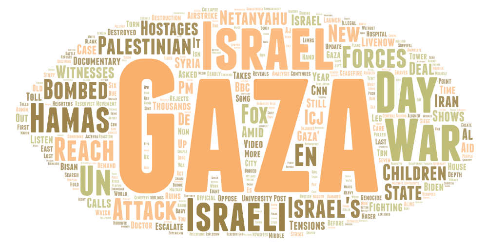
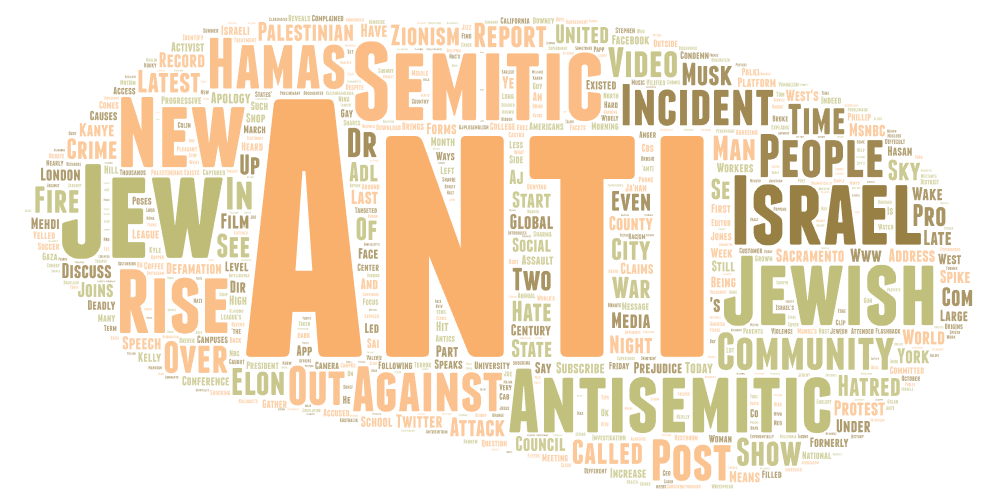

# Lab 2: Web Data Collection and Visualization
## Gaza Conflict on Youtube

The topic I chose is the conflict in Gaza because it is a very significant societal geographical issue right now. For the searches and the word cloud, the parameters were separated based on the stance on the issue. For the first search, a Palestinian-based approach was taken, with the terms *“palestine,” “zionist,” “genocide,”* and the neutral term *“gaza”* were used. In contrast, for the Israeli approach, the terms used were *“isreal,” “gaza,” “terrorist,” “hamas,” and “anti-semetic.”*

The use of these terms were chosen in hopes of seeing how the difference in search terms regarding the same topics leads to videos with certain beliefs being shown, and demonstrate how important which search terms used really matter and do make a difference, even when they are about the same topic.

The two word clouds are pretty similar, since they deal with the same topic. Both word clouds include terms such as “Hamas.” However, the Israeli world cloud is more focused on the anti-semetic search term, with that being the most common word. The Palestinian word cloud is much more focused on the topic, probably due to Palestine being more closely associated with the current conflict compared to Israel.

The possible reasons for this are because the search for the term “anti-semetic” is not isolated to this issue, and is related with other events, whereas Palestine became more relevant in media due to this conflict.

This research could be improved in the future to better isolate the search terms so it is within the confines of the Gaza conflict. This could be done by including more specific terms instead of more broad terms blanketing over the issue.

I was surprised that the videos found from Youtube for the Israel-focused search terms were not more recent, and instead included past current events. For instance, Kanye West's past anti-semtic statements and tweets were included, which happened several years ago.
